# ReactJS X NestJS X SQLite

ReactJS, NestJS, SQLite, JWT 를 활용한 Authorization / Authentication Flow

## ✏️ Session VS JWT

### 1. Session

-   User 의 정보는 서버에 저장
-   User 의 정보를 가져오기 위해 DB 에서 탐색필요
-   Client 에서 인증정보 확인 불가
-   Horizontal Scaling 어렵다

### 2. JWT Token

-   User 의 정보는 Token 의 Payload 에 저장
-   User 의 정보를 가져오기 위해 DB 에서 탐색 불필요
-   Client 에서 Payload 로 인증정보 확인 가능
-   Horizontal Scaling 쉽다

## ✏️ Refresh & Access Token

Access : 인증 필요한 API 요청시 검증용 토큰
Refresh : Access 토큰 추가 발급시 사용

Access 는 유효기간이 짧고, Refresh 는 길다

자주 노출되는 Access Token 은 유효기간이 짧아, Token 이 탈취되어도 해커가 오래 사용 불가

노출 적은 Refresh Token 은 Access Token 새로 발급시에만 사용, 탈취 가능성이 적음

## ✏️ Encryption
